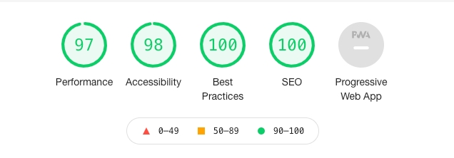

## Photo gallery proof of concept

Main goal is to try to be as minimal as possible.  
[Live preview](https://musing-thompson-d678aa.netlify.app/) ✨✨

### Lighthouse score

- React with typescript was used mainly without any external dependencies.
- Performant :white_check_mark:
- Fully accessible and a11y compliant :white_check_mark:
- WCAG 2.0 passing :white_check_mark:
- Responsive :white_check_mark:

### Running the app

- First clone the repo or extract from the zip file provided.
- `cd photo-gallery` and run `npm install` inside to install dependencies.

### Available scripts

- `start` Start the development server
- `build` Generate the build
- Open `localhost:3000` for the server

In case You want to run the production build by yoursel:
`npm run build` and then `npx serve ./build`

### Dependencies table

My aim is always to make things minimal as possible. Here is the list of used dependencies with its cost.

| name             | size         |
| ---------------- | ------------ |
| body-scroll-lcok | 1kb          |
| clsx             | 311b         |
| hoofd            | 1.8kb        |
| react-router-dom | 9.6kb        |
|                  | ~ 12kb total |

#### Reason behind these depenedencies

As You can tell, there aren't any UI libraries or animation packages includes. Everything is done using css and pure react / typescript.

- `body-scroll-lock` is basically fancy way of setting `overflow:hidden` on a body element when the modal is open. Since I was aiming for full `a11y` compliance, scroll lock was a must have feature for opening dialog / modal.
- `clsx` is a utility for constructing className strings conditionally. It is pretty lightweight and makes code much much simpler. Without this, one would do something like this `` 

 ``
- `hoofd` is a way to inject custom head elements using react hooks. I'm a big fan of `nextJS` framework when doing landing pages in need of `SEO` since it provides a way to have access to the each page head element. In plain react, this isn't possible (atleast that i know) in a nice way. Example can be found on the `collections page`.
- `react-router-dom` is a plain old router package. I was showcasing examples of multiple routes so it feels like an real app. I'm not a big fan of it's size though, so my main go-to on personal projects is `wouter` since its only `~1kb` heavy.

### Tips and gotchas

- Folder and code structure is something similar to `domain / feature oriented architecture`. I like to have separate `modules` for each feature. In this case feature is often called `page or route` with all it's `components`. This way it's much easier to find related components and files. There is also a `module` called `shared` where I keep shared UI elements and components as well as `hooks` and `assets`.
- Total bundle size is below `50kb`. It's lightweight for the most apps out there but it can be reduced down further. I strongly believe in fast web apps and want to make myself better in that term in the future. If this was an real app, I would probably add `preact and preact-compat` layer to the app. This way it would be using `preact` when building for production and most likely get to see `50%` smaller bundles.

- Page modal is using technique called `scroll lock`. Even though I don't like some quirks of it, a11y friendly websites needs it. This solves issues when opening a modal and You can still scroll page behind it. I've added prop called `blockScroll` on the Modal so it can be easily removed. Right now it skips to the top of the page when you open modal (since overflow is set). In ideal world I would be using something like [Inert attribute](https://github.com/WICG/inert) but I guess it still isn't production ready.
- Page is fully accessible using keyboard
- I've added basic SEO example on the second page. There are many many more meta tags to be added. I just showed basic SEO implementation for this showcase purpose.
- CSS modules are used heavily accross the app. I was a huge fan of `bem` nomenclature but css modules solves that issue exactly. No need to prefix classes since the scope is bound to the component itself. I've added basic css structure with heavy usage of `tokens / variables`. This way it's much easier to maintain css and make standards accross the entire app. Unfortunatelly, css modules have some quirks and `scss / postcss` isn't easily available using official `create react app`. Since I didn't have much time, I went with approach above. Ideally I would opt for something like `postcss with plugins` so I can leverage `functions, mixins and extending/composing` more naturally. Media queries are easier to write too that way hence `nesting syntax`. I'm a big fan of `tailwindcss` too and been using in production for quite some time (2.5 years).
- Most of the simple `animations / interactions` are pure css with animations and transitions. Quite a few things is possible these days and performance is through the roof. In case something more complex is needed I would probably add something like `framer-motion` or `react-spring`.
