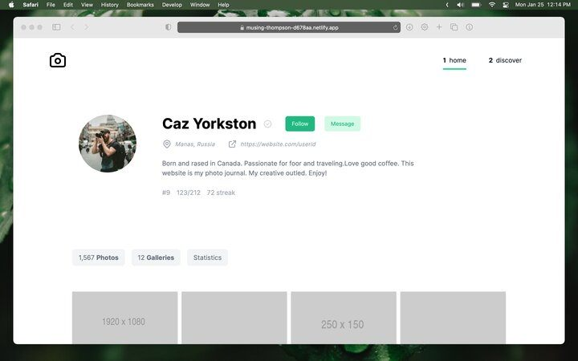

## Photo gallery proof of concept

Main goal is to try to be as minimal as possible.  
[Live preview](https://musing-thompson-d678aa.netlify.app/) ✨✨

### Lighthouse score

- React with typescript was used mainly without any external dependencies.
- Performant :white_check_mark:
- Fully accessible and a11y compliant :white_check_mark:
- WCAG 2.0 passing :white_check_mark:
- Responsive :white_check_mark:

### Homescreen preview

[Check other screenshots](screenshots/) :sparkler::sparkler:

### Available scripts

- `start` Start the development server
- `build` Generate the build
